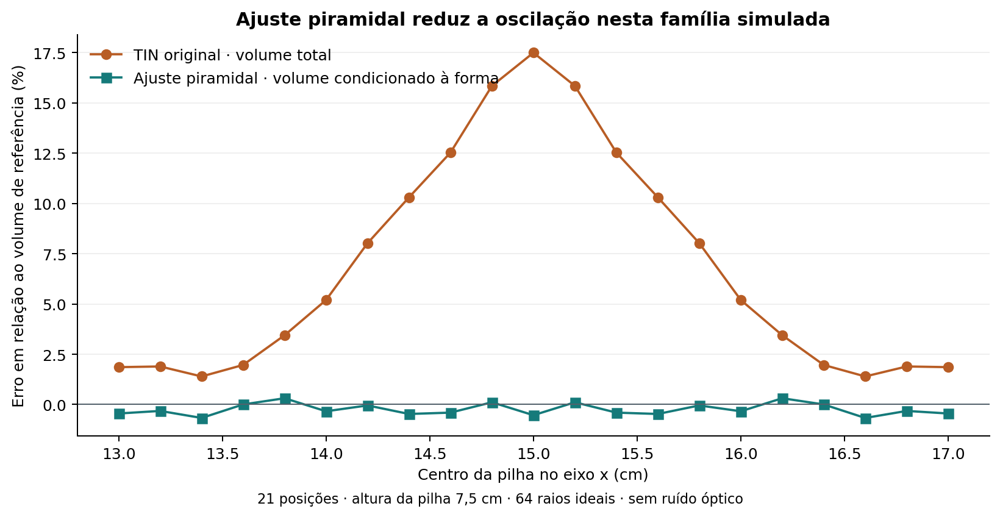
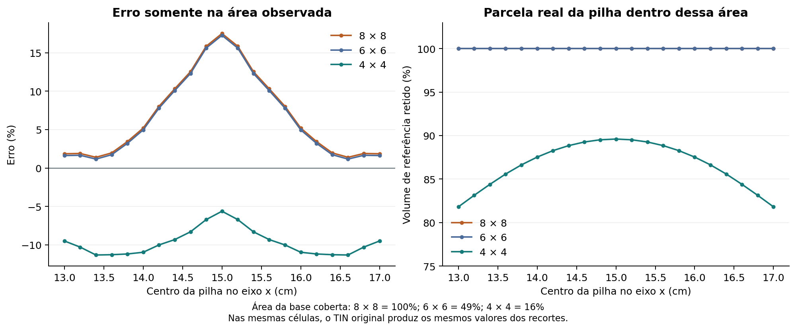
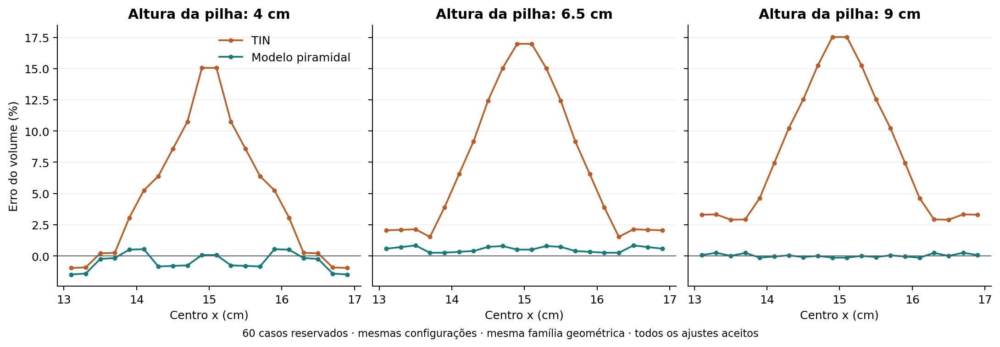
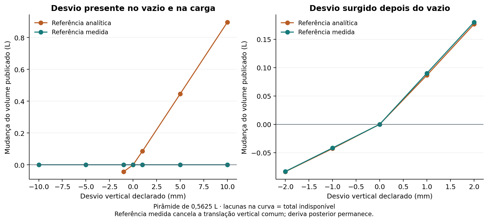

# BoxFlow — comparação experimental dos 64 pontos

Data: 13/09/2026. Base de 30 × 30 cm, sensor a 40 cm, 64 raios ideais. **Todos os resultados são de simulação geométrica, com transporte `native-c-test`.**

## Decisão para o MVP

**Mantenha o VL53L5CX para a maquete. Entre os métodos testados, o ajuste de pirâmide é o melhor candidato para demonstrar uma pilha única aproximadamente piramidal.** Ele reduziu a amplitude do erro de 16,11 para 0,98 pontos percentuais na varredura principal. Isso depende da hipótese de forma e ainda precisa de ensaio físico. Não aprova medição genérica de pilhas.

| Opção | Melhor uso neste projeto | Limitação decisiva |
| --- | --- | --- |
| VL53L5CX, 64 zonas | MVP com maquete e hardware identificado | Driver físico, calibração e precisão ainda não validados |
| Aquisição mais densa | Referência de desenvolvimento e futura seleção para escala real | O mock anterior não corresponde a um equipamento comercial escolhido ou cotado |
| TIN livre original | Mostrar superfície observada, lacunas e casos fora da hipótese piramidal | Variação relevante do erro mesmo com cobertura completa |
| Ajuste piramidal experimental | Estimar volume condicionado a uma pilha dessa família | Pode rejeitar outras formas; bom ajuste não prova que toda a superfície tenha essa forma |

Há uma [biblioteca Arduino da SparkFun](https://github.com/sparkfun/SparkFun_VL53L5CX_Arduino_Library) para integrar o dispositivo. O protocolo 0x42 do mock continua sendo próprio: **o firmware do pacote ainda não é o driver do VL53L5CX físico**. A comparação anterior de 64 versus 3.185 raios, na mesma maquete, permanece em [COMPARACAO.md](COMPARACAO.md).

O código novo fica em `experiments/`. O dashboard mantém o TIN original. O modelo retorna `model_volume_m3` separado de `observed_volume_m3`; não converte extrapolação em cobertura medida nem substitui silenciosamente um total parcial. E4 e E3 foram avaliados separadamente; sua combinação não foi validada.

## E0 — protocolo e reprodução

Foram executados 21 centros entre 13 e 17 cm, passo 2 mm, com pilha de 7,5 cm e volume de referência 0,5625 L. O `protocol.json` foi fixado antes dos novos ensaios de filtros e ajuste. Seu SHA-256 é `4284d6b9921bc7f13e40c87c5d2fc417c312172881db6e560742faea45221e0c`. Ele registra limites, posições, alturas reservadas e métricas. Os limites são decisões de desenvolvimento, não valores de precisão do sensor ou ângulo de repouso medido.

Resultados do TIN original: mediana **5,20%**, média **6,78%**, mínimo **1,39%**, máximo **17,50%**, amplitude **16,11 pp**, desvio-padrão populacional **5,35 pp**. Todos os 21 quadros tiveram `valid`, sem transições de estado. Portanto, **6,78% era a média, não a mediana** no briefing.

O comparador também executou 60 casos reservados: 20 posições intercaladas, de 13,1 a 16,9 cm, para alturas de pilha 4,0, 6,5 e 9,0 cm. São outros pontos da mesma família geométrica, não uma validação independente do sensor físico. Não foi aplicado fator de correção treinado no volume verdadeiro.



### Separação entre estimativa e verdade

`estimators.py` recebe apenas quadro binário, referência geométrica e configuração fixa. `measured_zero.py` aprende o vazio a partir de quadros binários. Nenhum deles importa `truth.py`, o simulador ou o manifesto.

Somente o avaliador conhece forma, preenchimento, centro e volume verdadeiro. O volume de referência de cada célula é integrado por recorte exato de faces lineares; a soma é conferida contra fórmulas independentes dos sólidos. Essa integração é usada para pontuar resultados, nunca para reconstruí-los.

O erro de volume total só é calculado quando há total publicado. Para métodos parciais, o erro usa o volume verdadeiro **dentro da união das células reportadas**, com área e fração de volume retido ao lado. Também são calculadas a interseção com a área do TIN original e a interseção comum a todos os filtros, quadro a quadro. As máscaras podem mudar entre cenas; os JSON preservam essas áreas. Não comparar uma parte observada com a verdade do box inteiro como se fosse precisão do total.

## E1 e E2 — recortes e inclinação

Erros abaixo se referem à área própria de cada método; somente a primeira e a última linha publicam total em todos os 21 casos.

| Método | Mediana do erro (%) | Amplitude (pp) | Desvio-padrão (pp) | Área da base coberta (%) | Volume verdadeiro retido (%) | Totais válidos |
| --- | ---: | ---: | ---: | ---: | ---: | ---: |
| TIN original, 8 × 8 | 5,20 | 16,11 | 5,35 | 100,00–100,00 | 100,00–100,00 | 21/21 |
| Recorte central 6 × 6 | 4,96 | 16,11 | 5,35 | 49,00–49,00 | 100,00–100,00 | 0/21 |
| Recorte central 4 × 4 | -10,01 | 5,70 | 1,65 | 16,00–16,00 | 81,81–89,60 | 0/21 |
| Inclinação ≤ 35° | 41,65 | 68,62 | 25,11 | 85,75–87,25 | 26,00–43,37 | 0/21 |
| Inclinação ≤ 45° | 11,99 | 19,38 | 6,99 | 94,00–97,75 | 67,12–84,80 | 0/21 |
| Inclinação ≤ 55° | 5,20 | 16,11 | 5,35 | 100,00–100,00 | 100,00–100,00 | 21/21 |

**E1:** o recorte 6 × 6 não diminuiu a amplitude. O recorte 4 × 4 passou numericamente pelo alvo de amplitude menor que 8 pp, mas observa só 16% da base e perde de 10,4% a 18,2% do volume verdadeiro da pilha. Seu viés mediano é −10,01% mesmo nessa parte. Além disso, comparado nas mesmas células, o TIN original retorna exatamente os mesmos valores: houve seleção de região, sem correção dos valores reconstruídos. Portanto, E1 não sustenta troca do estimador de volume total.

**E2:** foram testados limites de inclinação da superfície de 35°, 45° (principal) e 55°. O ângulo é calculado do gradiente do plano das alturas relativas à base. Mantivemos o limite de aresta de 10 cm como proteção adicional; não é uma substituição literal de todo o gate anterior. Triângulos descartados deixam células desconhecidas.

O limite principal de 45° piorou a amplitude e a mediana na região restante, com cobertura de 94% a 97,75%; falhou no alvo de 8 pp. O corte de 35° removeu ainda mais faces úteis. A pirâmide de referência tem faces com inclinação de 45°, e a quantização pode colocá-las acima do limite. As transições falsas para o piso nem sempre são mais íngremes que as faces verdadeiras. O limite de 55° não alterou a varredura principal. Nenhuma configuração tem troca de estado nessa varredura: são sempre válidas ou sempre parciais; a cobertura parcial, porém, varia.



## E3 — ajuste condicionado à forma

Foram ajustadas duas hipóteses separadas, pirâmide quadrada alinhada aos eixos e cone. Cada uma estima centro x/y, altura e inclinação por mínimos quadrados, usando todos os pontos válidos e retornos de piso. A meia base ou raio é derivada como altura/inclinação: não há um parâmetro redundante independente para o ângulo.

As inicializações vêm das medições. Não se passa o centro verdadeiro, a altura verdadeira ou a forma da cena. O nome do modelo é uma hipótese declarada pelo operador, aplicada inclusive aos controles incompatíveis. O ajuste exige pelo menos seis pontos acima de 3 mm, oito retornos de piso, RMS de até 1,5 mm, resíduo máximo de 4 mm, Jacobiana de posto quatro, condicionamento limitado, parâmetros internos aos limites e base contida no box. Esses gates são experimentais e não foram ajustados para aprovar os resultados reservados.

Para a pirâmide, o volume do modelo é `4 × altura³ / (3 × inclinação²)`; para o cone, substitui-se 4 por π. Os parâmetros são inferidos dos retornos. Quando um gate falha, `model_volume_m3` fica nulo e o estado é `inconclusive`; o volume candidato, se existente, fica explicitamente diagnóstico.

| Conjunto | Mediana TIN (%) | Amplitude TIN (pp) | Mediana modelo (%) | Amplitude modelo (pp) | Desvio-padrão modelo (pp) | Ajustes aceitos |
| --- | ---: | ---: | ---: | ---: | ---: | ---: |
| Principal, 7,5 cm | 5,20 | 16,11 | -0,34 | 0,98 | 0,29 | 21/21 |
| Reservado, 4,0 cm | 4,15 | 16,02 | -0,50 | 2,03 | 0,68 | 20/20 |
| Reservado, 6,5 cm | 5,22 | 15,45 | 0,54 | 0,59 | 0,21 | 20/20 |
| Reservado, 9,0 cm | 6,04 | 14,62 | 0,00 | 0,39 | 0,13 | 20/20 |
| Reservados agrupados | 4,94 | 18,49 | 0,07 | 2,32 | 0,58 | 60/60 |

Na cena central, o modelo estimou **0,559502 L**, contra referência 0,5625 L: erro **-0,53%**, altura estimada **7,458 cm** e inclinação **44,83°**. O alvo de amplitude menor que 5 pp foi atingido na varredura principal e nas três alturas reservadas. Não foi necessária correção multiplicativa nesses ensaios ideais.

**Limite da conclusão:** a família matemática da pirâmide ajustada coincide com a família geradora dessas cenas. Isso demonstra identificação de parâmetros com 64 raios ideais; não demonstra a mesma precisão em uma pilha real irregular ou em retornos misturados. O recorte 8 × 8 é mantido para o ajuste, pois o piso ajuda a restringir a base.

Os controles incluíram duas pilhas, prisma, rampa e camada. A hipótese piramidal recusou essas quatro famílias nas 12 configurações testadas; em duas pilhas e camada, mudar `centerX` não altera a cena, portanto essas configurações não são observações independentes. Aceitou a pirâmide com viga e com perdas configuradas em 20% e 50% dos retornos, com erros condicionais próximos de −0,5%; isso continua sendo extrapolação da hipótese. Recusou perda total, falta de alcance e vazio.

O cone foi recusado em todos os 21 casos principais e aceito em apenas 8 de 60 casos reservados, embora eles fossem pirâmides. Logo, baixo resíduo não identifica automaticamente a forma real. Não declaramos o cone um vencedor com base apenas nos oito casos aceitos.



## E4 — vazio medido, erro comum e deriva

Foi construída uma referência a partir de oito aquisições nativas do vazio. Por zona, as coordenadas são médias de retornos válidos em todos os quadros; a superfície é interpolada linearmente dentro do fecho convexo desses pontos. Fora dessa área, a referência é desconhecida. As alturas usam essa superfície medida. O decodificador mantém validações de pacote, pose, alcance, parede e viga, com envelope fixo de −10 cm para não deixar o antigo piso analítico eliminar previamente medições do vazio com desvio. A base analítica não é subtraída pelo estimador E4.

O mock é determinístico: a repetibilidade desses oito quadros é zero. Esse teste **não mede redução de ruído por média** nem simula deriva temporal. Os desvios foram injetados explicitamente no avaliador, com CRC recalculado, sem informar seus valores ao estimador.

Uma translação vertical declarada de −10 a +10 mm, aplicada ao vazio e à carga, cancelou no cálculo com referência medida. O resultado permaneceu em **0,660907 L**, ainda cerca de +17,5% acima da verdade: a referência medida não resolve o erro de amostragem/interpolação do TIN.

Quando o desvio aparece somente depois da aquisição do vazio:

| Desvio vertical posterior (mm) | Volume com referência medida (L) | Erro contra a verdade (%) | Estado |
| --- | ---: | ---: | --- |
| -2 | 0,577768 | 2,71 | valid |
| -1 | 0,619168 | 10,07 | valid |
| 0 | 0,660907 | 17,49 | valid |
| 1 | 0,750906 | 33,49 | valid |
| 2 | 0,840907 | 49,49 | valid |

De 0 para +1 mm, a diferença é aproximadamente **0,09 L**, ou 16% do volume verdadeiro dessa pilha. O comportamento negativo é assimétrico pelo corte das alturas negativas em zero. A relação `área × desvio` continua relevante, mas não é uma curva global linear quando suporte, validade ou corte mudam.

Também foi injetado desvio comum de distância radial. Ele não cancela completamente: altera as coordenadas horizontais e a área reconstruída. Com +10 mm, o volume observado com referência medida chegou a 0,695957 L; com −10 mm, a cobertura caiu para 81% e o total ficou nulo. Uma deriva radial de +1 mm levou 28 pontos para fora do suporte aprendido e a cobertura caiu para 49%. Isso expõe a política conservadora dessa interpolação, não uma taxa de falha física medida.

No ensaio da camada a 40 cm, apenas 64% da base teve suporte. A sensibilidade da parte observada à translação vertical posterior foi aproximadamente 0,0576 L/mm, correspondente à área observada de 0,0576 m². Não extrapolamos esse volume parcial para a camada inteira.

**Decisão:** E4 é útil para compensar componentes comuns sob pose e condições estáveis. Não autoriza afirmar que erro de referência foi eliminado. O módulo informa mudança de pose declarada; antes do uso físico, a calibração deve ser vinculada à montagem e revalidada após mudanças. O modo entregue é diagnóstico e não muda a política do dashboard.



## Correções de montagem e de interpretação do briefing

30 × 30 cm é uma escolha de bancada, não um tamanho ótimo obrigatório do fabricante. O [datasheet ST, Rev. 13](https://www.st.com/resource/en/datasheet/vl53l5cx.pdf) informa campo nominal de 45° por eixo, condicionado a alvo, distância, luz e configuração. Usando essa projeção ideal, a largura a 40 cm é 33,14 cm. No mock, o passo entre centros de zonas no piso é 4,142 cm; a distância do raio de canto ao piso plano seria cerca de 449,5 mm, com inclinação de 27,14°.

A tabela 20 do datasheet, em 8 × 8 contínuo a 15 Hz, informa para alvo cinza e cantos a 5 klx: alcance típico de 650 mm e mínimo de 400 mm, nas condições de ensaio. Portanto, 449,5 mm não garante margem nesse caso. A tabela 21 também não sustenta tratar a quantização de 1 mm do mock como precisão física. A configuração é um ponto de partida a testar com material e iluminação da demonstração. [Fonte ST](https://www.st.com/resource/en/datasheet/vl53l5cx.pdf).

Reproduzimos a varredura de altura do sensor para a camada com 7,5 cm de espessura:

| Sensor acima do piso (cm) | Cobertura da camada (%) | Estado |
| --- | ---: | --- |
| 35 | 49,00 | partial |
| 40 | 64,00 | partial |
| 43 | 81,00 | partial |
| 45 | 81,00 | partial |
| 47 | 90,00 | partial |
| 48 | 100,00 | valid |
| 49 | 73,00 | partial |
| 50 | 49,00 | partial |

Elevar de 40 para 45 cm melhora de 64% para 81%, mas ainda não produz total. Nesse conjunto, 48 cm dá cobertura completa; subir mais perde retornos úteis para paredes. Isso não é recomendação de 48 cm para qualquer cena. Existem coberturas como 90% e 73%, além dos quadrados perfeitos citados no briefing. A tabela completa, de 28 a 50 cm, está no JSON.

O mock faz primeira interseção de **raios pontuais** com malha. Não há mistura de retornos dentro da zona, reflexão múltipla ou ruído óptico. Portanto, a oscilação reproduzida não prova *mixed pixels* ou *flying pixels* do sensor físico. A interpolação entre amostras esparsas já basta para produzir erro neste modelo. A causa completa não foi decomposta formalmente; a analogia com Cavalieri não é uma demonstração causal desse TIN. As alegações universais ou de ineditismo do briefing não são conclusões destes ensaios.

## E5 e E6 — demonstração e próximos limites

O editor Wokwi foi aberto e a criação de Custom Chip estava disponível. A conferência das tentativas de colagem não confirmou arquivos idênticos. A importação dos arquivos originais foi então **recusada pela revisão automática de autorização**, porque enviaria código e configuração potencialmente privados ao serviço externo Wokwi sem autorização explícita para esse conteúdo e destino. A importação não foi retomada por outra via.

**E5 permanece pendente:** não se observou o firmware ESP32 desta entrega lendo o mock e publicando HTTP. Não há token de execução CLI disponível nesta sessão. Os binários e o teste WASM anteriores permanecem no pacote; executar WASM em Node e HTTP nativo não comprova essa cadeia. Não foi criado projeto público nem endpoint hospedado.

Para continuar E5, é necessária autorização para enviar os arquivos de `wokwi/` ao Wokwi. O receptor também precisa ser acessível: o [gateway público não alcança a rede local; o privado oferece esse acesso](https://docs.wokwi.com/guides/esp32-wifi). A [CLI exige token configurado](https://docs.wokwi.com/wokwi-ci/cli-usage). A configuração concreta a conferir está em `wokwi/config.h`, `wokwi/diagram.json` e `wokwi/wokwi.toml`.

E6 (servo e múltiplas vistas) era opcional. Não foi implementado. A entrega permite avaliar primeiro o modelo condicionado e a calibração do vazio, antes de acrescentar movimento e erros de pose.

## Executar e auditar

Servidor e replay continuam com Python 3.10+ e biblioteca padrão. **Os experimentos exigem Python 3.11+**, NumPy, SciPy e Matplotlib; foram executados em Python 3.12.14. Para reproduzir todas as cenas, instale também GCC ou Clang. No Windows, `py -3` pode substituir `python`; o compilador C deve estar no PATH.

```bash
python -m pip install -r experiments/requirements.txt
python tools/generate_samples.py
python -m experiments.run_comparison
python -m experiments.run_zero
python -m unittest experiments.test_experiments -v
python -m experiments.plot_results
python -m experiments.report_results
```

Para analisar uma amostra pronta sem executar o simulador C:

```bash
python -m experiments.analyze_frame samples/17-principal.bin --prior square_pyramid
python -m experiments.analyze_frame samples/17-principal.bin --prior square_pyramid --empty samples/01-vazio.bin
```

O segundo comando demonstra o uso de uma referência pronta de um quadro; o ensaio E4 usa oito aquisições. A saída distingue TIN, modelo condicionado e referência medida. Não informa volume verdadeiro ao estimador.

**Verificação desta etapa:** dez testes novos passaram. Eles verificam integração de referência contra fórmulas independentes, equivalência do TIN com o servidor, preservação de lacunas, recuperação paramétrica, rejeição de formas incompatíveis, cancelamento de desvio comum, persistência de deriva, suporte finito do vazio e rejeição de pacote corrompido. A equivalência da grade original também foi conferida em cada um dos 99 casos do comparador. A curva de alturas tem mais 46 configurações; E4 tem 48 configurações de injeção, pontuadas por dois métodos (96 registros). Repetições e duplicatas determinísticas não são amostras estatísticas independentes.

Os testes anteriores não foram usados para declarar os novos métodos aprovados. As mudanças desta etapa são ferramentas offline, dados e documentação; o estimador do servidor, firmware, mock C e WASM foram preservados. A evidência dos dez testes está em `build/experiment-tests.txt`; o status anterior segue em [TESTES.md](TESTES.md).

Arquivos principais:

- `build/experiments/comparison.json`: todas as cenas, grades, máscaras, erros, gates e resumos.
- `build/experiments/measured-zero.json`: desvio comum e deriva, com estados e cobertura.
- `build/experiments/frames/`: quadros binários identificados por SHA-256.
- `experiments/protocol.json` e `.sha256`: configuração fixada.
- `docs/experiments/`: quatro figuras em PNG e SVG.
- `docs/BRIEFING_RECEBIDO.md`: briefing original preservado, não incorporado como conclusão verificada.
- `build/experiments/artifact-hashes.json`: integridade de código, protocolo, resultados e figuras.
