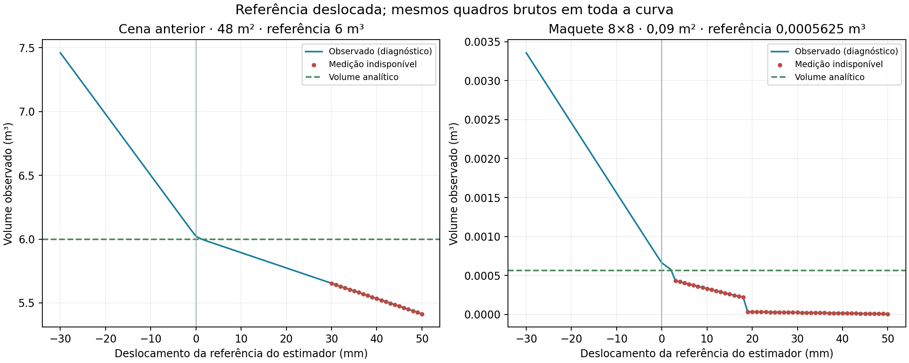
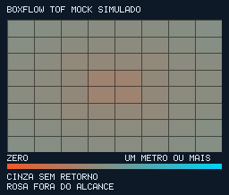

# Testes e resultados — maquete de 30 cm, referência v3

Pacote reconstruído após a indisponibilidade do download. **26 testes funcionais passaram** na conferência de 16/09/2026, incluindo o contrato da nova abstração do sensor. As quatro pirâmides centrais continuam reprovando a meta de desenvolvimento de erro de 5%; passar testes funcionais não aprova precisão.

| Verificação | Evidência e limite |
| --- | --- |
| Python/C++ host | 26 testes: geometria, unidades, referência antiga, calibração deslocada, CRC, ausência/falhas, histórico, HTTP e backend `SimTofSensor` |
| WASM real | Recompilado com WASI SDK 25 e executado no Node: snapshot, blocos de 28 bytes, freeze, NACK, limites, recuperação; 704 bytes, 8×8 e referência 3 |
| ESP32 | Recompilado em 16/09/2026 com Arduino CLI 1.2.0 e Arduino-ESP32 3.3.0; programa 1.066.159 bytes (81%), globais 48.684 (14%); não é execução do ESP32 |
| Cenas e replay | 17 quadros regenerados e aceitos por HTTP; último observado 0,0006609339357486352 m³; transporte native-c-test, 64 zonas |
| Interface | JavaScript passou em node --check; rotas servidas; favicon retornou 204; não houve nova inspeção do dashboard no navegador |
| Sensibilidade | 162 avaliações, 81 desvios em dois perfis com quadros brutos fixos |
| Resolução | 17 cenas × 2 distribuições de raios em condições controladas |
| Montagem | Quatro alturas × três cenas com o mesmo gerador/estimador |

## Volumes

Piso 0,30×0,30 m, sensor (0,15; 0,15; 0,40), campo ideal 45° por eixo, grade 1,5 cm, aresta máxima 10 cm. Corte 4 m, exceto 0,2 m no ensaio fora de alcance. Os dígitos permitem reproduzir resultados e não indicam precisão física.

| Cena | Referência m³ | Observado m³ | Cobertura | Estado | Erro do total | Meta 5% |
| --- | ---: | ---: | ---: | --- | ---: | --- |
| vazio | 0,000000000 | 0,000004441 | 100,00% | valid | — | Não aplicável |
| entrada-25 | 0,000187500 | 0,000208823 | 100,00% | valid | 11,37% | REPROVA |
| entrada-50 | 0,000375000 | 0,000433881 | 100,00% | valid | 15,70% | REPROVA |
| entrada-75 | 0,000562500 | 0,000660934 | 100,00% | valid | 17,50% | REPROVA |
| entrada-100 | 0,000750000 | 0,000905937 | 100,00% | valid | 20,79% | REPROVA |
| redistribuicao | 0,000562500 | 0,000590570 | 100,00% | valid | 4,99% | Atende |
| duas-pilhas | 0,000425000 | 0,000435754 | 100,00% | valid | 2,53% | Atende |
| oclusao | 0,000562500 | 0,000416720 | 70,00% | partial | — | Não aplicável |
| sem-retorno | 0,000562500 | — | 0,00% | unavailable | — | Não aplicável |
| fora-alcance | 0,000562500 | — | 0,00% | unavailable | — | Não aplicável |
| retirada-50 | 0,000375000 | 0,000433881 | 100,00% | valid | 15,70% | REPROVA |
| retirada-25 | 0,000187500 | 0,000208823 | 100,00% | valid | 11,37% | REPROVA |
| retirada-vazio | 0,000000000 | 0,000004441 | 100,00% | valid | — | Não aplicável |
| prisma | 0,001687500 | 0,001334769 | 84,00% | partial | — | Não aplicável |
| rampa | 0,000843750 | 0,000934938 | 100,00% | valid | 10,81% | REPROVA |
| camada | 0,006750000 | 0,004328526 | 64,00% | partial | — | Não aplicável |
| principal | 0,000562500 | 0,000660934 | 100,00% | valid | 17,50% | REPROVA |

O vazio mantém cerca de 0,004441 L de resíduo. A pirâmide principal estima 0,660934 L para 0,5625 L de referência. A camada de 6,75 L fica parcial: 64% de cobertura. Seu teste compara somente área observada × espessura analítica. A cena principal e as retiradas repetem cenas; não criam observações independentes de precisão.

## Referência deslocada independentemente

O script modifica somente o piso conhecido pelo estimador. A cena antiga usa o quadro/estimador v1 congelados em tests/fixtures/v1; a atual usa reference_offset_m. O gerador não recebe o desvio.

| Perfil | Desvio | Observado m³ | Estado |
| --- | ---: | ---: | --- |
| v1-48m2 | -20 mm | 6,980261134 | valid |
| vl53-maquette-0.09m2 | -20 mm | 0,002457373 | valid |
| v1-48m2 | -10 mm | 6,500261134 | valid |
| vl53-maquette-0.09m2 | -10 mm | 0,001557373 | valid |
| v1-48m2 | +0 mm | 6,022768904 | valid |
| vl53-maquette-0.09m2 | +0 mm | 0,000660934 | valid |
| v1-48m2 | +10 mm | 5,894005891 | valid |
| vl53-maquette-0.09m2 | +10 mm | 0,000331650 | unavailable |
| v1-48m2 | +50 mm | 5,414005891 | unavailable |
| vl53-maquette-0.09m2 | +50 mm | 0,000006227 | unavailable |

O caso histórico reproduz diferença de 0,48 m³ por centímetro sobre 48 m². Na maquete, 1 mm sobre 0,09 m² equivale aproximadamente a 0,09 L quando suporte/truncamento não mudam. Erros positivos podem invalidar a referência pelo limite de desenvolvimento de 3 mm. Pontos vermelhos são diagnósticos observados, não totais aceitos. Mais zonas não removem deslocamento sistemático do piso.

## Limites e roteiro restante

A 40 cm do piso, vazio e pilha central têm 100% de suporte no modelo; uma camada alta sobre toda a base permanece parcial. Veja MONTAGEM_30CM e COMPARACAO.

ESP32 emulado → I²C mock → gateway → HTTP continua pendente. Compilar o firmware e executar o WASM no host de callbacks não comprovam esse percurso. Em 16/09/2026, duas tentativas no editor Wokwi falharam antes da simulação por conectividade e por HTTP 524 na fila de compilação. A CLI 0.26.1 está instalada, mas não há `WOKWI_CLI_TOKEN`; não há projeto publicado. O usuário confirmou o dashboard v1 em seu navegador, não esta revisão inteira.

Não houve teste com sensor físico, ULD real, luz ambiente, poeira ou material granular. O mock reduz zonas a raios pontuais ideais.

1. Monte os arquivos atuais no Wokwi e configure endpoint/gateway. Confira 64 zonas, 704 bytes, CRC OK, HTTP 200 e transporte wokwi-esp32.
2. Execute vazio, entrada, redistribuição e retirada. Compare com o manifesto sem confundir suporte e precisão.
3. Ative viga: parcial e total nulo. Use dropout=100 ou rangeM=0.2: indisponível.
4. Teste freeze, NACK, recuperação e interrupção superior a 45 s reais.
5. Integre o driver físico, calibre referência/pose/zonas e compare com objetos aferidos, preservando estados parciais.

